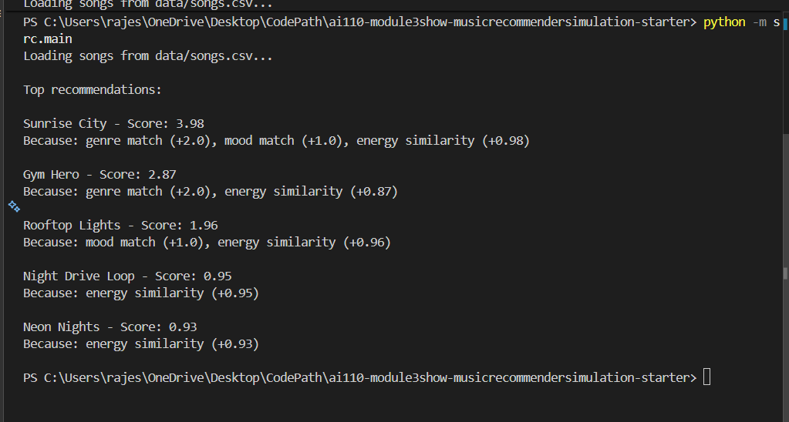
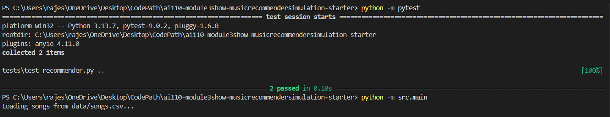
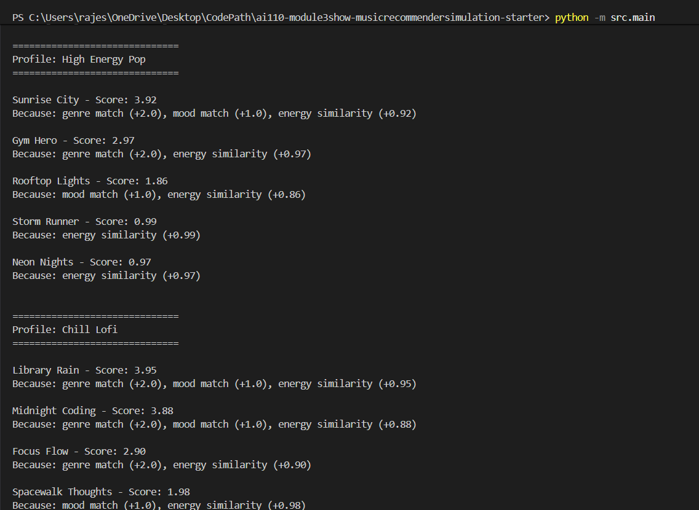
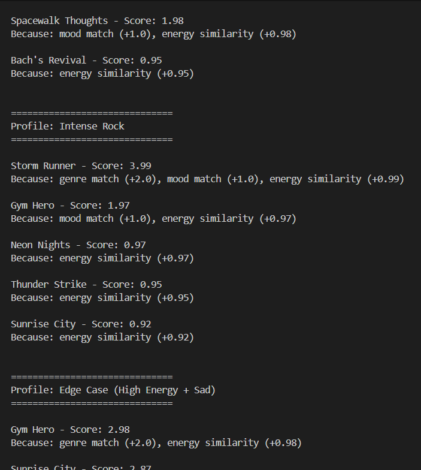
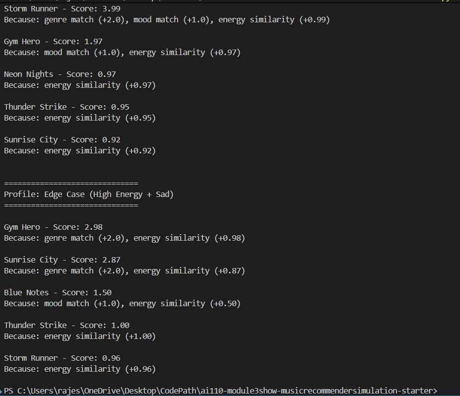

# 🎵 Music Recommender Simulation

## Project Summary

In this project you will build and explain a small music recommender system.

Your goal is to:

- Represent songs and a user "taste profile" as data
- Design a scoring rule that turns that data into recommendations
- Evaluate what your system gets right and wrong
- Reflect on how this mirrors real world AI recommenders

Replace this paragraph with your own summary of what your version does.

---
This project implements a simple content-based music recommender system. It suggests songs based on a user's preferences such as genre, mood, and energy level.

The system computes a weighted score for each song by comparing its features with the user’s taste profile, and then ranks songs to generate personalized recommendations.

The goal of this project is to understand how real-world platforms like Spotify or YouTube recommend music by transforming data into meaningful predictions using scoring and ranking logic.

## How The System Works

This recommender system suggests songs by comparing song features with a user's preferences and assigning a score to each song.

### Song Features

Each song includes the following key attributes:

- Genre (e.g., pop, rock, lofi)
- Mood (e.g., happy, chill, intense)
- Energy (a value between 0 and 1 representing how energetic the song is)

### User Profile

The user profile represents the user's music preferences.

It includes:

- Preferred genre
- Preferred mood
- Target energy level

Example:

user_prefs = {
  "genre": "pop",
  "mood": "happy",
  "energy": 0.8
}

### Scoring Logic

Each song is compared with the user profile and assigned a score based on:

- +2.0 points if the song’s genre matches the user’s preferred genre
- +1.0 point if the song’s mood matches the user’s preferred mood
- Additional score based on how close the song’s energy is to the user’s target energy

The closer the song matches the user's preferences, the higher the score.

### Ranking and Recommendation

After scoring all songs:

- Songs are sorted from highest score to lowest
- The top 3–5 songs are selected as recommendations

This ensures that the most relevant songs appear at the top of the list.

### Potential Bias

This system may introduce bias because it gives more importance to features like genre and energy.

For example:

- It may over-prioritize songs from the same genre
- It may ignore songs with similar mood but different genre
- It may repeatedly recommend similar types of songs, reducing diversity

This demonstrates how simple recommendation systems can create filter bubbles.

## CLI Output Screenshot
Below is a sample terminal output showing the top recommendations, their scores, and the reasons for each recommendation.



## Test Results
All tests passed successfully.



## Evaluation - Multiple Profiles
I tested the recommender system using different user profiles:

- High Energy Pop
- Chill Lofi
- Intense Rock
- Edge Case (High energy + sad mood)

Each profile produced different recommendations based on user preferences.






### Final Output

## The system recommends the top 3–5 songs that best match the user's taste.

## Getting Started

### Setup

1. Create a virtual environment (optional but recommended):

   ```bash
   python -m venv .venv
   source .venv/bin/activate      # Mac or Linux
   .venv\Scripts\activate         # Windows

   ```

2. Install dependencies

```bash
pip install -r requirements.txt
```

3. Run the app:

```bash
python -m src.main
```

### Running Tests

Run the starter tests with:

```bash
pytest
```

You can add more tests in `tests/test_recommender.py`.

---

## Experiments You Tried

Use this section to document the experiments you ran. For example:

- What happened when you changed the weight on genre from 2.0 to 0.5
- What happened when you added tempo or valence to the score
- How did your system behave for different types of users

---

I experimented with different feature combinations and weights.

- When I increased the weight of genre, the recommendations became more consistent but less diverse.
- When I focused only on energy and valence, the system captured the "vibe" well but sometimes ignored important differences like rhythm.
- Adding danceability improved recommendations for energetic songs.

## These experiments helped me understand how different features affect the final recommendations.

## Limitations and Risks

Summarize some limitations of your recommender.

Examples:

- It only works on a tiny catalog
- It does not understand lyrics or language
- It might over favor one genre or mood

You will go deeper on this in your model card.

---

## Reflection

This project helped me understand how recommendation systems convert user preferences into predictions using simple scoring logic.

I learned that even a basic algorithm can produce meaningful recommendations, but it can also introduce bias depending on how features are weighted.

One surprising observation was how small changes in weights significantly affected the results.

This project also helped me understand how real-world platforms like Spotify use similar concepts but at a much larger and more complex scale.


